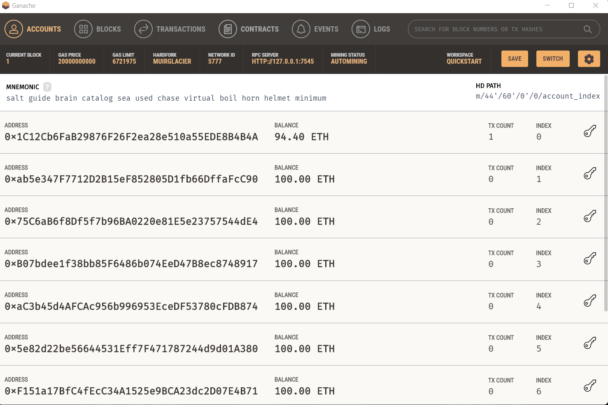
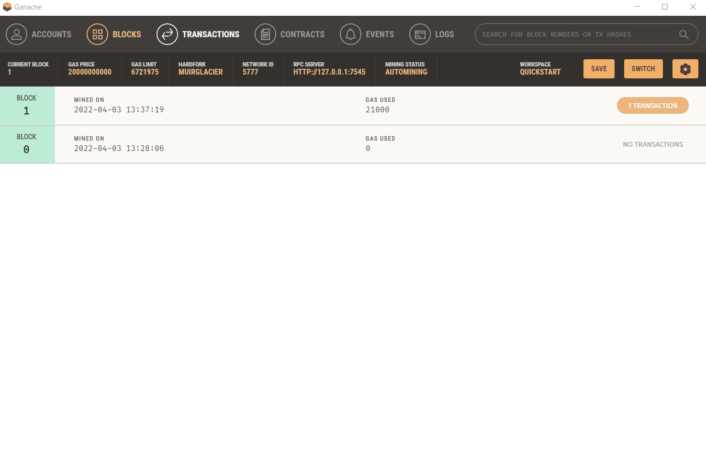
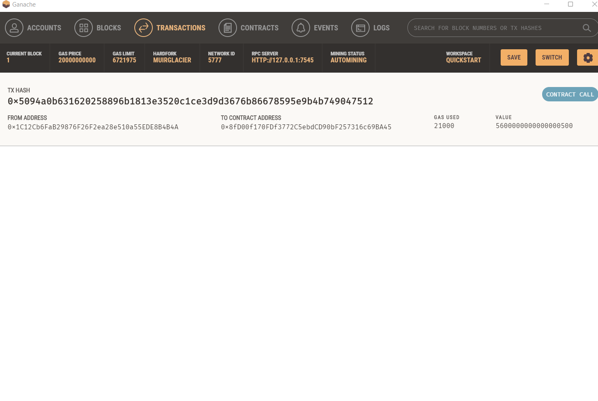

## Cryptocurrency Wallet

### Background

You work at a startup that is building a new and disruptive platform called Fintech Finder. Fintech Finder is an application that its customers can use to find fintech professionals from among a list of candidates, hire them, and pay them. As Fintech Finder’s lead developer, you have been tasked with integrating the Ethereum blockchain network into the application in order to enable your customers to instantly pay the fintech professionals whom they hire with cryptocurrency.

In this Challenge, you will complete the code that enables your customers to send cryptocurrency payments to fintech professionals. To develop the code and test it out, you will assume the perspective of a Fintech Finder customer who is using the application to find a fintech professional and pay them for their work.

---
## Instructions

1. Clone to your local device 
2. Add your .env file to directory
3. Open your terminal in the location of the file, fintech_finder.py.
4. Activate the environment to run the app.
5. Type into the terminal streamlit run fintech_finder.py.
6. It will open in your chosen browser. 
7. Select a candidate from the sidebar select box.
8. Input the number of hours you wish to hire them for then press enter.
9. Check the Wage if it is smaller than your Account Balancee which can be seen at top of sidebar, you can press the send transaction button at the bottom. 
10. If Successful the app will release balloons, and confirm below send transaction button. 
11. Check your crypto wallet for transaction.

## Video Instruction Step Through

## Ganache Transaction Confirmation Challenge Screenshots

### Wallets

### Blocks

### Transactions

